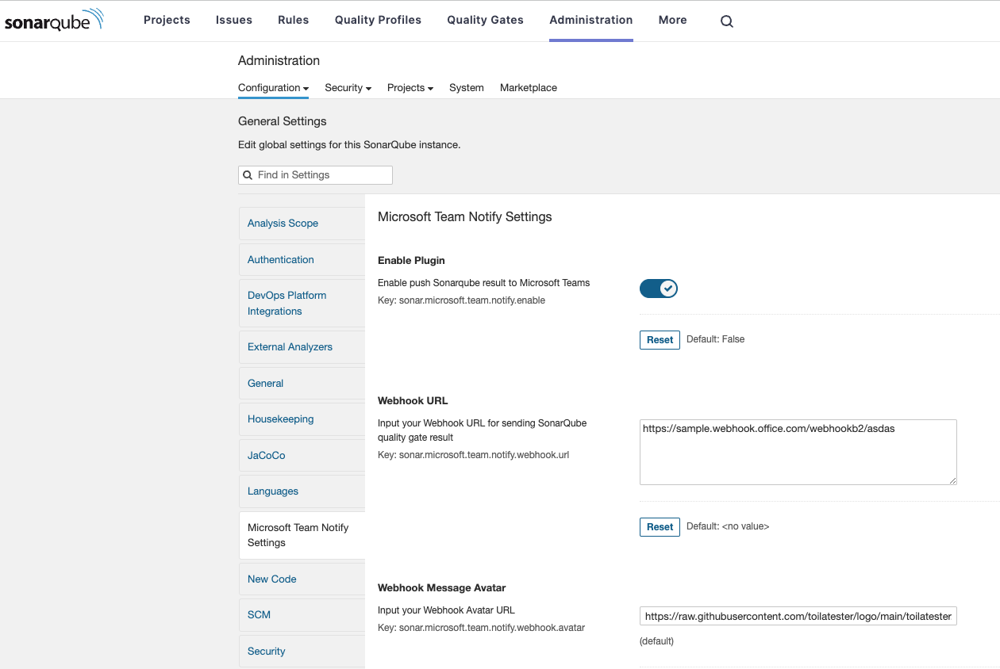

# Sonar Microsoft Teams Notifier

The **Sonar Microsoft Teams Notifier** is a SonarQube plugin that seamlessly sends SonarQube analysis results to Microsoft Teams, enhancing code quality insights and promoting better collaboration among development teams. With this plugin, you can receive real-time notifications about your project's code quality directly in your Microsoft Teams channels.

## Features

- **Automated Notifications**: Receive automated notifications in your Microsoft Teams channels whenever a SonarQube analysis is completed for your project.

## Prerequisites

Before setting up the Sonar Microsoft Teams Notifier plugin, make sure you have set up the incoming webhook in your Microsoft Teams channel by following the guide provided in the [Microsoft Teams documentation](https://learn.microsoft.com/en-us/microsoftteams/platform/webhooks-and-connectors/how-to/add-incoming-webhook?tabs=dotnet).

## Installation

To set up the Sonar Microsoft Teams Notifier plugin, follow these steps:

1. **Download the Plugin**: Obtain the latest release of the plugin JAR file from the [Releases](https://github.com/toilatester/sonar-microsoft-teams-notifier/releases) page of this repository.

2. **Copy JAR to Extensions Directory**: Copy the downloaded JAR file of the Sonar Microsoft Teams Notifier plugin to the `extensions/plugins` directory of your SonarQube installation.

3. **Restart SonarQube**: Restart your SonarQube server to load the newly added plugin.

## Building the Plugin (Optional)

If you want to build the plugin from source and test your changes locally, follow these steps:

1. **Clone the Repository**: Clone the repository to your local machine.

2. **Build the Plugin**: Navigate to the root directory of the cloned repository and build the plugin using the provided build tool (e.g., Maven). Run the appropriate command:

   ```sh
   # For Maven
   mvn clean package
   ```

3. **Copy JAR to Extensions Directory**: After building the plugin, locate the JAR file in the `target` directory (created during the build process). Copy the JAR file to the `extensions/plugins` directory of your SonarQube installation.

4. **Restart SonarQube**: Restart your SonarQube server to load the newly built plugin.

## Configuration

You can configure the plugin either through the SonarQube configuration UI or using the Sonar Scanner command-line tool.

### Using SonarQube Configuration UI

1. Log in to your SonarQube server as an administrator.

2. Navigate to **Administration** > **Configuration**.

3. Locate the **Sonar Microsoft Teams Notifier** section.

4. Configure the following options:

   - **Enable Plugin**: Set the value of `sonar.notify.microsoft.team.enable` to `true` to enable the plugin.
   - **Webhook URL**: Set the value of `sonar.notify.microsoft.team.webhook.url` to the Microsoft Teams webhook URL where you want to receive notifications.
   - **Webhook Message Avatar**: Set the value of `sonar.notify.microsoft.team.webhook.avatar` to the URL of the avatar image you want to use for the notifications.
   - **Webhook Send On Failed**: Set the value of `sonar.notify.webhook.fail.only.enable` to enable send notify when analysis failed
5. Save the configuration.

[](docs/sonar-microsoft-teams-notifier.png)

### Using sonar-scanner command or sonar-project.properties

When running the Sonar Scanner command, you can provide the configuration options as command-line parameters:

**Example command:**
```sh
mvn clean verify sonar:sonar -Dsonar.notify.microsoft.team.enable=true -Dsonar.notify.webhook.fail.only.enable=true -Dsonar.notify.microsoft.team.webhook.url=<your-webhook-url> -Dsonar.notify.microsoft.team.webhook.avatar=<avatar-url>
```

**Example sonar-project.properties**
```properties
sonar.notify.microsoft.team.enable=true
sonar.notify.microsoft.team.webhook.url=<your-webhook-url>
sonar.notify.microsoft.team.webhook.avatar=<avatar-url>
sonar.notify.webhook.fail.only.enable=true
```
Replace `<your-webhook-url>` with your actual Microsoft Teams webhook URL and `<avatar-url>` with the URL of the avatar image.

## Test the Configuration

1. Run a SonarQube analysis on a project to trigger the notifications.

2. Check your Microsoft Teams channel for the automated notifications containing the SonarQube analysis results.

## Feedback and Contributions

Your feedback and contributions to the Sonar Microsoft Teams Notifier plugin are highly appreciated! If you encounter any issues, have suggestions for improvements, or would like to contribute to the project, please feel free to [open an issue](https://github.com/your-username/sonar-microsoft-teams-notifier/issues) or [create a pull request](https://github.com/your-username/sonar-microsoft-teams-notifier/pulls).

## License

This plugin is distributed under the [Apache License 2.0](LICENSE).

---

**Disclaimer**: This plugin is not officially endorsed or supported by SonarQube or Microsoft. Use it at your own discretion.
